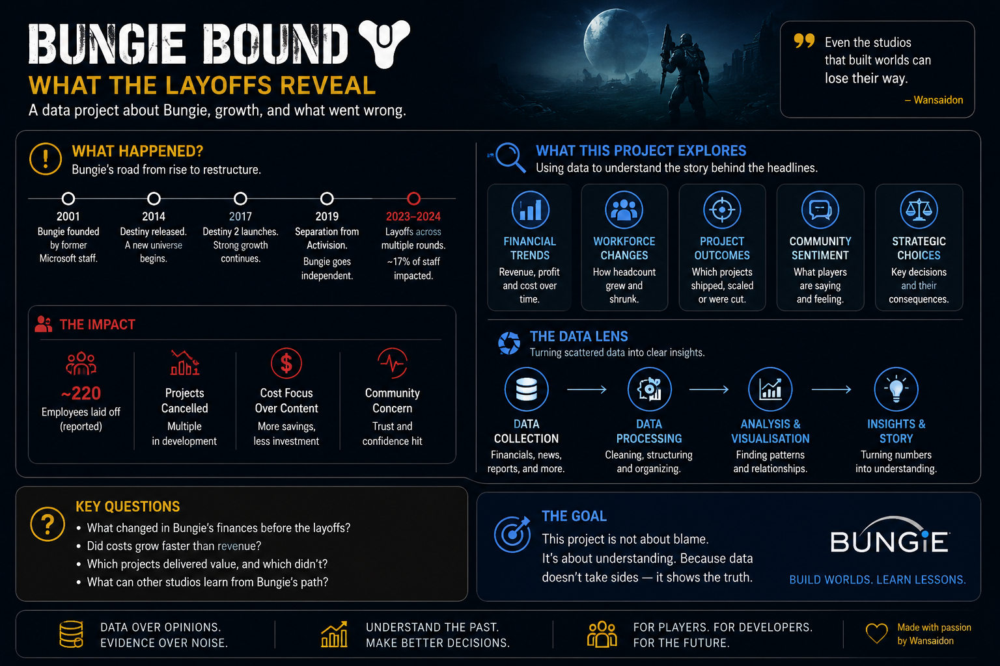

# 🎮 Bungie Bound — Change Career Means Start From Zero Meh?

> **You've worked for years. Then you want to change career.  
> Suddenly every job asks for experience.**
>
> **Wah... all my old experience useless already ah?** 😂

That's the idea behind **Bungie Bound**.

My example uses moving from **audio into game audio**, but the same
question can apply to anyone changing careers.

---

---

## 🔄 You Don't Come Empty-Handed

Changing industry doesn't erase everything you learned.

Your old job may have taught you:

**🤝 Teamwork**

**🧠 Problem solving**

**🔥 Handling pressure**

**👥 Leadership**

**🗣️ Working with people**

These skills may still be useful.

But the new job will also have things you don't know yet.

---

## 🔍 So Check the Jobs

Instead of anyhow taking courses:

**What skills do employers want?**

**What do I already have?**

**What am I missing?**

Then:

### ✅ Already Have
Keep it.

### 🔒 Don't Have
Learn it.

Simple.

> **Don't collect certificates like Pokémon. Learn what you actually need.** 😂

---

## 🎮 My Example

For game audio, I may already have audio experience.

But gaming may ask for things like:

**Sound Design**

**Wwise**

**Unreal Engine**

So I'm not asking:

> **"Am I starting from zero?"**

I'm asking:

> ## **"What am I bringing over, and what do I still need to learn?"**

---

# 🏆 The Simple Idea

**Keep what you know**

↓

**Learn what's missing**

↓

**Build something**

↓

**Show what you can do**

↓

**Apply**

> ## **New career. Same person. Different skills to learn.**

That's **Bungie Bound**.

---

## 🐍 Python Version

[View `career_roadmap.py`](career_roadmap.py)

---

## ⚠️ Disclaimer

A personal career and data project. Job requirements change and no
career path is guaranteed.

## ✍️ Credits

**Idea & analysis:** Wansaidon  
**Written with:** ChatGPT by OpenAI